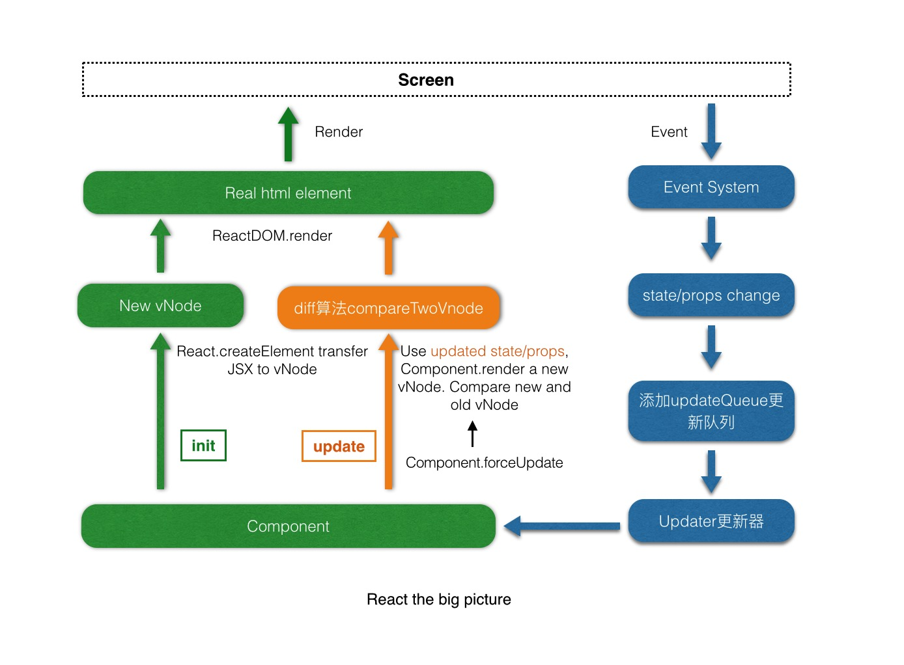
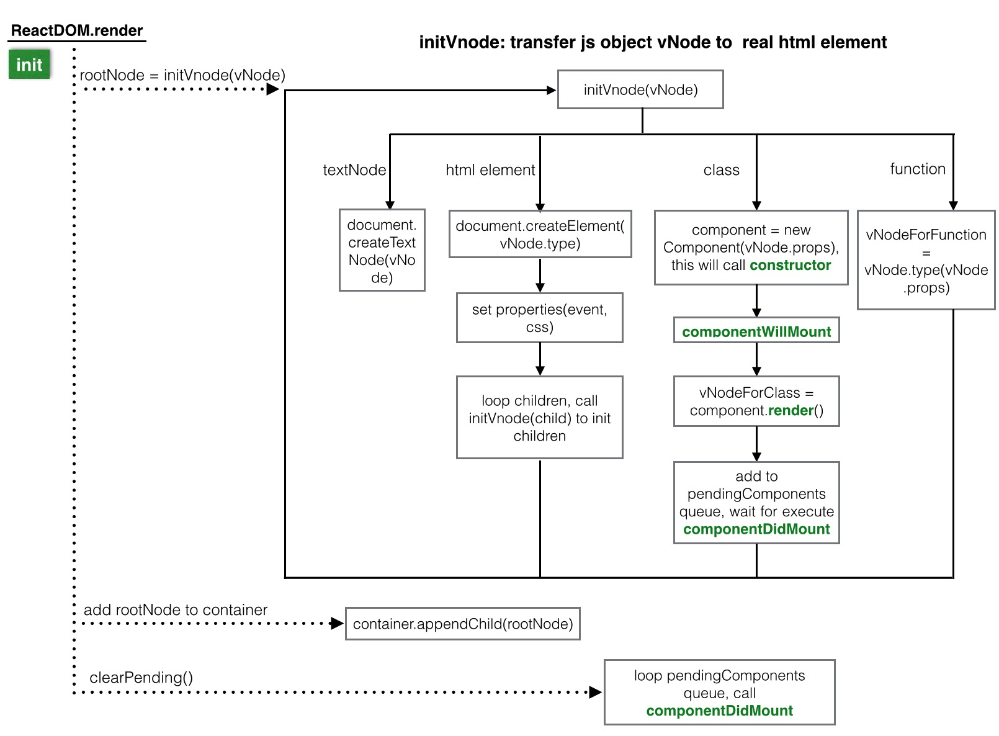
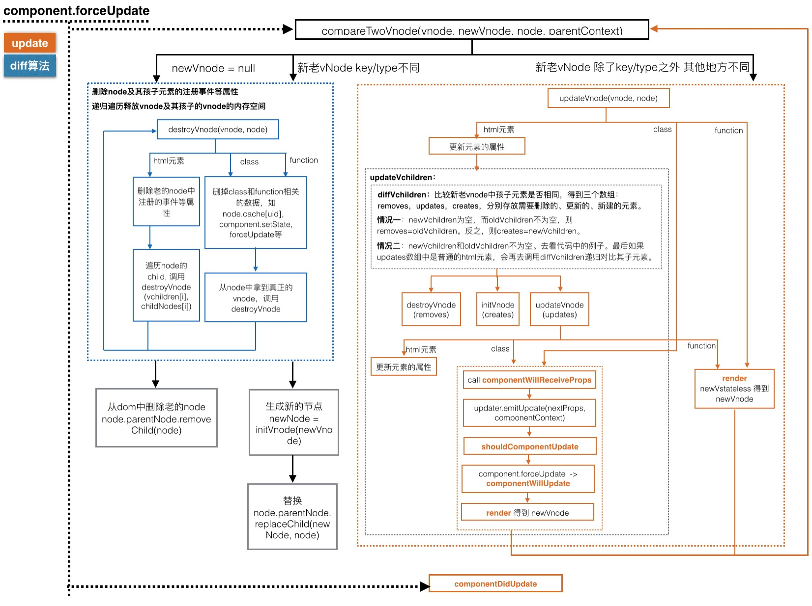

# React

这是一个简单版本的React，涉及到更新队列updateQueue, 更新器Updater，事件系统，Component的初始化、更新以及diff算法。



## React.createElement

JSX是一个Javascript的语法扩展。我们在react中使用JSX时，每个 JSX 元素都是调用 React.createElement()来生成 virtual-node。
后面简称vnode。

一般不会手动调用React.createElement，react会在解析JSX时自动帮我们调用这个函数。

```js
React.createElement(
  type,
  [props],
  [...children]
)
```

生成的vnode的结构是:

```js
let vnode = {
	vtype: vtype, // 用来区分原生html元素、class组件、function组件
	type: type, // 具体的html元素类型或class或function
	props: props,
	refs: refs,
	key: key,
	ref: ref,
	uid: 2  
}
```

可以看出来vnode只是一个js对象，props中存放了父组件传进来的数据和children。之后在更新页面的时候对vnode进行diff操作就是比较新老vnode的数据是否一致。

## ReactDOM.render

```js
ReactDOM.render(vnode, container, callback)
```
将React.createElement产生的vnode转换成真正的DOM元素，作为child添加到container上。



## component.forceUpdate

diff算法: compareTwoVnodes



## setState批量合并和callback函数

## 事件系统

## React.createContext

```js
let myContext = React.createContext(defaultValue);
```

## 其他
关于vnode到真实dom元素的转换细节。
通过createElement生成最初的vNode数据结构是这样的：

```js
let vnode = {
	vtype: vtype, // 用来区分原生html元素、class组件、function组件
	type: type, // 具体的html元素类型或class或function
	props: props, // 包括children、style、onClick等等在内的各种属性 
	refs: refs,
	key: key,
	ref: ref,
	uid: 2  
}
```
我们根据其vtype来分情况生成真实的dom元素。
### 当vtype是一个class类型时，例如`class Message{}`
vcomponent就是上面说的vnode

|vcomponent| component = new Message(props)| vnode = component.render() | 真正的dom元素 node=initVnode(vnode) |
| --- | --- | --- | --- |
| vtype=VCOMPONENT | `component.$cache: ` `$cache.vnode=vnode` `$cache.node=node` |  |`node.cache: ` `cache[uid]=component`  |
| type= class Message | $updater |  |  |
| props | props=vcomponent.props |  |
| uid |  |  |  |
| key |  |  |  |
| ref |  |  |  |

props中的style、onClick等等不会真的起作用，他们会被当做从父组件传进来的props。

### 当vtype是一个function类型时，例如`function Title(){}`
vstateless就是上面的vnode

| vstateless | vnode = Title(props) | 真实的dom元素 node=initVnode(vnode) |
| --- | --- | --- |
| vtype=VSTATELESS |  | `node.cache[uid]=vnode` |
| type=function Title |  |  |
| props |  |  |
| uid |  |  |  |
| key |  |  |  |
| ref |  |  |  |

props中的style、onClick等等不会真的起作用，他们会被当做从父组件传进来的props。

### 当vtype是一个html元素时，例如`div`
velement就是上面的vnode

| velement | 真实的dom元素 node=document.createElement('div') | 
| --- | --- |
| vtype=VELEMENT |  |
| type=div |  |  
| props | 此时props中的style、onClick等才会起作用 |  
| uid |  |  
| key |  |   
| ref |  | 

